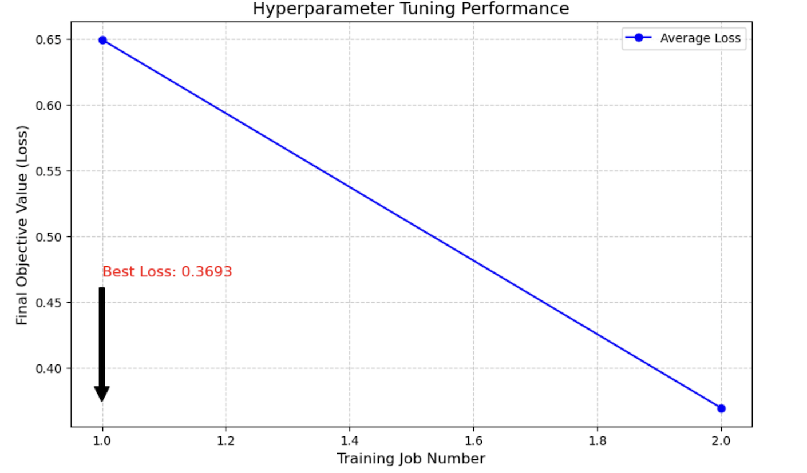
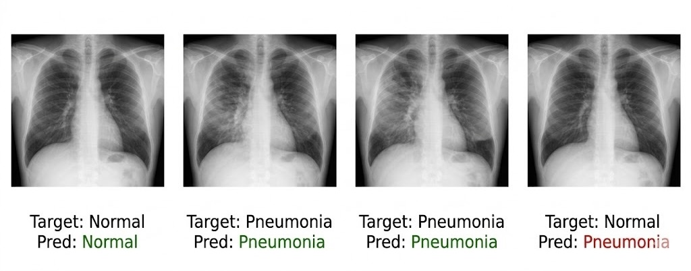

# Medical Image Classification using AWS SageMaker

This repository demonstrates an end-to-end Machine Learning pipeline developed on AWS SageMaker for medical image classification. The project focuses on detecting Pneumonia from X-ray images using advanced cloud-native tools and Deep Learning.

## 📁 Project Structure

* **`Untitled.ipynb`**: The main driver notebook containing data orchestration, training jobs, and deployment logic.
* **`hpo.py`**: A specialized training script optimized for SageMaker Hyperparameter Optimization (HPO).
* **`Model_Performance_Report.pdf`**: Detailed documentation of the model architecture, tuning results, and infrastructure setup.
* **`performance_metrics.png`**: Visualization of the hyperparameter tuning process and loss convergence.
* **`inference_results.png`**: Sample predictions from the deployed endpoint showing the model's performance on real medical data.

## 🚀 Project Highlights

### 🧠 Model Architecture & Transfer Learning
The project utilizes **Transfer Learning** with a pre-trained **ResNet18** model. By fine-tuning the final layers, the model was adapted to classify medical images with high precision while reducing training time and computational costs.

### ⚙️ Hyperparameter Optimization (HPO)
I leveraged SageMaker’s automatic model tuning to find the best configuration:
- **Best Learning Rate**: 0.001
- **Best Batch Size**: 2
- **Final Objective Value (Loss)**: 0.3693

### 🛠️ Debugging & Profiling
To ensure a robust training process, I integrated **SageMaker Debugger and Profiler**:
* **SMDebug**: Used to track loss curves and monitor for overfitting or vanishing gradients.
* **Resource Monitoring**: Tracked CPU/GPU utilization to optimize instance performance.

## 🌐 Real-Time Inference
The model is deployed to a **SageMaker Endpoint** (`ml.m5.large`), providing a scalable interface for real-time clinical diagnosis. Below is a sample of the model's output where it correctly identifies "Normal" vs "Pneumonia" cases.

---
*Developed by Ghaida Alharbi*
